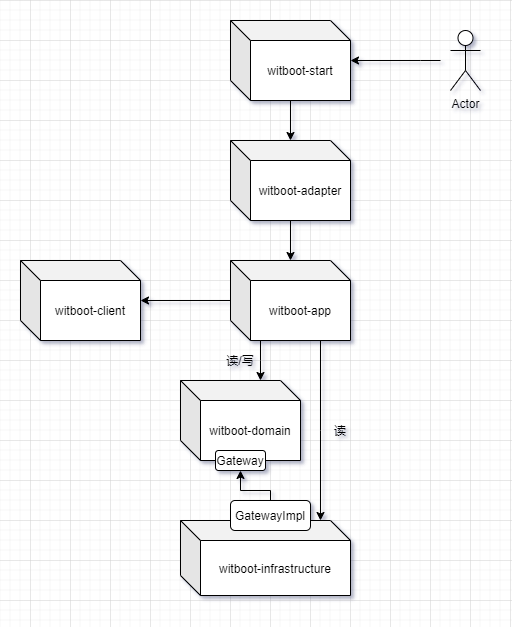
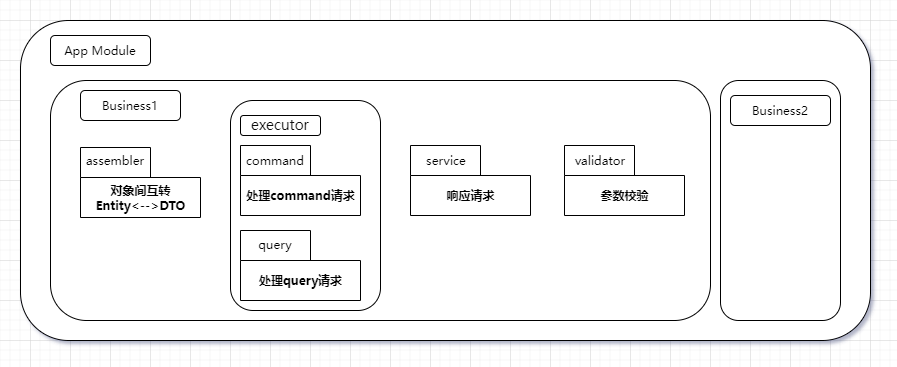
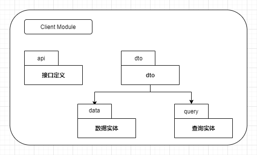
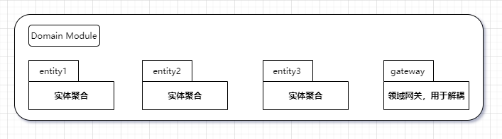
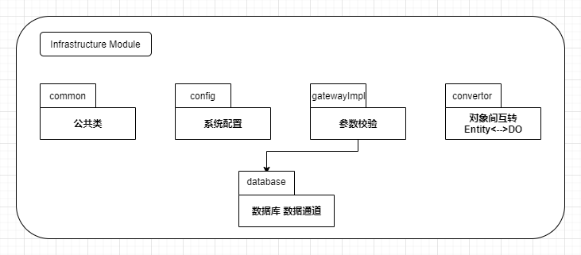

# WitBoot

> 本项目结合Spring Boot3.0.6和COLA 4.0（整洁面向对象分层架构）实现。

## 项目架构图

## 组件构成
* **witboot-start**：
* **witboot-adapter**：
* **witboot-app**：
* **witboot-client**：
* **witboot-domain**：
* **witboot-infrastructure**：

## 模块规范

## 集成功能列表
- [x] SpringBoot Security集成
- [x] Swagger Knife4j增强
- [ ] 接口版本
- [ ] MyBatis-Plus
- [x] MySQL
- [x] Druid
- [ ] Validate校验（接口）
- [x] 统一数据返回
- [x] 统一异常处理
- [x] Actuator
- [x] log4j2配置
- [ ] Redis
- [ ] Elasticsearch
- [ ] Kafka
- [ ] Flyway
- [ ] 接口限流
- [ ] 接口幂等性
- [ ] 接口加签验签

## 功能列表
- [ ] 用户管理
- [ ] 部门管理
- [ ] 菜单管理
- [ ] 角色权限管理
- [ ] 字典管理
- [ ] 性能监控
- [ ] 数据变更记录
- [ ] 操作日志记录
- [ ] Redis监控

## 特性
* 数据比对器，简化数据对比
* 路由守卫

## 开发规范

### 方法名约定
|CRUD操作| 方法名约定 |
|---|---|
|新增| create |
|添加| add |
|删除| remove（App和Domain层），delete（Infrastructure层） |
|修改| update |
|查询（单个结果） | get |
|查询（多个结果） | list |
|分页查询| page |
|统计| count |

### 命名规范
|规范|用途|解释|
|---|---|---|
|xxxCO| Client Object | 客户对象，用于传输数据，等同于DTO |
|xxxCmd| Client Request | Cmd代表Command，表示一个写请求 |
|xxxQuery| Client Request | Query，表示一个读请求 |
|xxxCmdExe| Command Executor | 命令模式，每一个写请求对应一个执行器 |
|xxxQueryExe| Query Executor | 命令模式，每一个读请求对应一个执行器 |
|xxxVO| Value Object | 值对象 |
|xxxEntity| Entity | 领域实体 |
|xxxDO| Data Object | 数据对象，用于持久化 |
|xxxInterceptor| Command Interceptor | 拦截器，用于处理切面逻辑 |
|IxxxService| API Service | xxxServiceI |
|xxxDomainService| Domain Service | 需要多个领域对象协作时，使用DomainService |
|xxxValidator| Validator | 校验器，用于校验的类 |
|xxxAssembler| Assembler | 组装器，DTO <---> Entity，用于Application层 |
|xxxConvertor| Convertor | 转化器，Entity <---> DO，用于Infrastructure层 |

### 公众号
